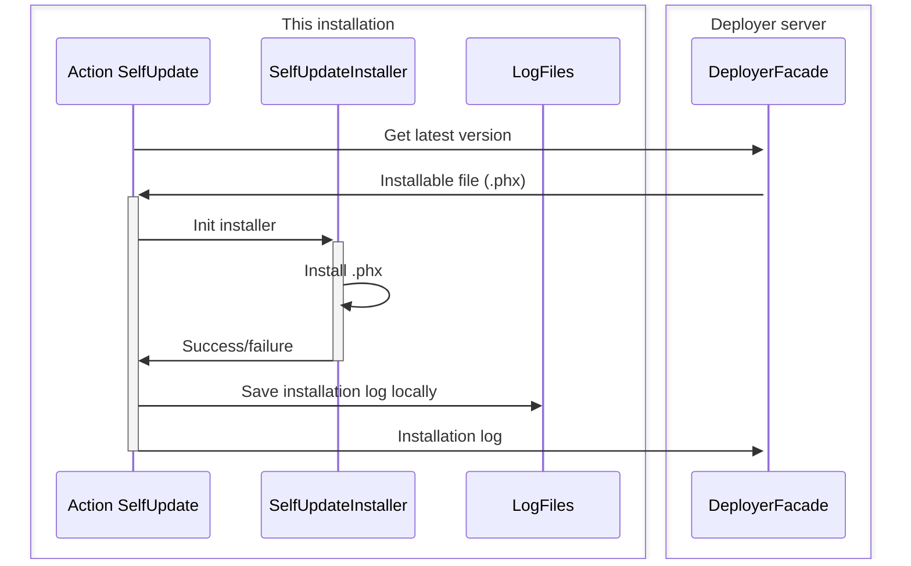
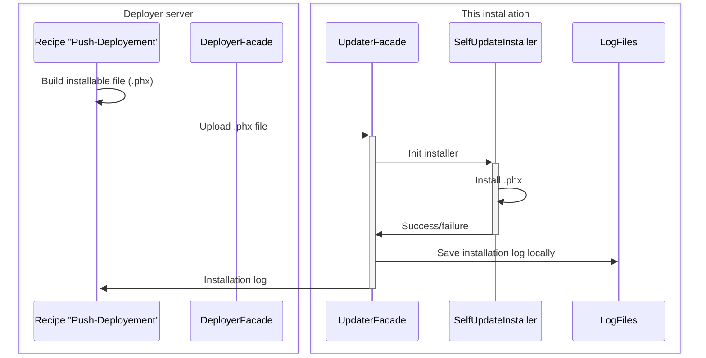

# Automatic updates

## Download updates from a central build-server (pull-deployment)

```mermaid

sequenceDiagram
    box This installation
    participant Action SelfUpdate
    participant SelfUpdateInstaller
    participant LogFiles
    end
    box Deployer server
    participant DeployerFacade
    end
    Action SelfUpdate ->>+ DeployerFacade: Get latest version
    DeployerFacade ->>+ Action SelfUpdate: Installable file (.phx)
    Action SelfUpdate ->>+ SelfUpdateInstaller: Init installer
    SelfUpdateInstaller ->> SelfUpdateInstaller: Install .phx
    SelfUpdateInstaller ->>- Action SelfUpdate: Success/failure
    Action SelfUpdate ->> LogFiles: Save installation log locally
    Action SelfUpdate ->>- DeployerFacade: Installation log
    
```

## Get push-updates from an external deployer

```mermaid
sequenceDiagram
    box Deployer server
    participant Recipe "Push-Deployement"
    participant DeployerFacade
    end
    box This installation
    participant UpdaterFacade
    participant SelfUpdateInstaller
    participant LogFiles
    end
    Recipe "Push-Deployement" ->>+ Recipe "Push-Deployement": Build installable file (.phx)
    Recipe "Push-Deployement" ->>+ UpdaterFacade: Upload .phx file
    UpdaterFacade ->>+ SelfUpdateInstaller: Init installer
    SelfUpdateInstaller ->> SelfUpdateInstaller: Install .phx
    SelfUpdateInstaller ->>- UpdaterFacade: Success/failure
    UpdaterFacade ->> LogFiles: Save installation log locally
    UpdaterFacade ->>- Recipe "Push-Deployement": Installation log
```